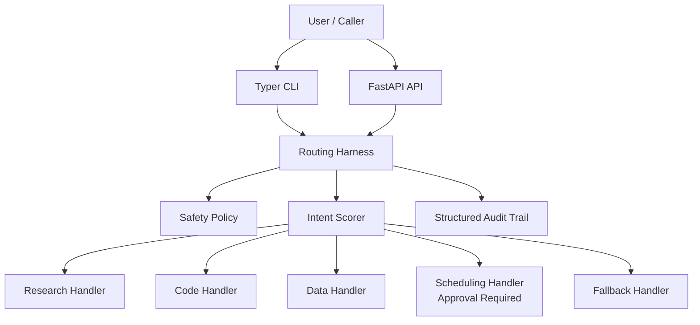

# Router Dispatcher Agent

Confidence-scored intent router that dispatches research, code, data, and scheduling requests to explicit handlers.

## Why this repo matters

This repo demonstrates a production-friendly alternative to hidden prompt routing: intent scoring, deterministic handlers, fallback behavior, and approval gates for high-risk routes.

## Architecture



## Quickstart

```powershell
pwsh .\scripts\bootstrap.ps1
pwsh .\scripts\verify.ps1
pwsh .\scripts\run_demo.ps1
```

## CLI examples

```powershell
python -m router_dispatcher_agent run "Research zero-downtime rollout practices and include citations." --json-output
python -m router_dispatcher_agent run "Debug this failing unit test and stack trace." --json-output
python -m router_dispatcher_agent run "Book a release review meeting tomorrow." --auto-approve --json-output
```

## Useful API endpoint

POST /v1/agent/run dispatches a message and returns route, confidence, approvals, and audit events.

## Mocked vs real

- **Real:** CLI, API, router, confidence threshold, approval gating, audit trail, tests, and evals are real.
- **Mocked or simulated:** Research snippets, code guidance, data guidance, and meeting times are deterministic fakes.

## Safety

- Blocks inbound prompt injection.
- Treats research snippets as untrusted data.
- Uses explicit handler capabilities only.
- Requires approval for scheduling route execution.
- Falls back when confidence is low or ambiguous.

## Evaluation

`evals/dataset.jsonl` plus `python scripts/run_evals.py` provide deterministic regression checks.

## Limits

- Keyword routing is deterministic and narrow.
- Research results come from a local fake corpus.
- Scheduling is staged, not connected to a real calendar.

## Roadmap

- Add learned confidence calibration behind the same interface.
- Track per-route service-level metrics.
- Support richer route explanations and A/B evaluation.

## Portfolio value

This repository is designed to be interview-ready: small enough to inspect quickly, serious enough to discuss production guardrails, and explicit about what is mocked versus real.
