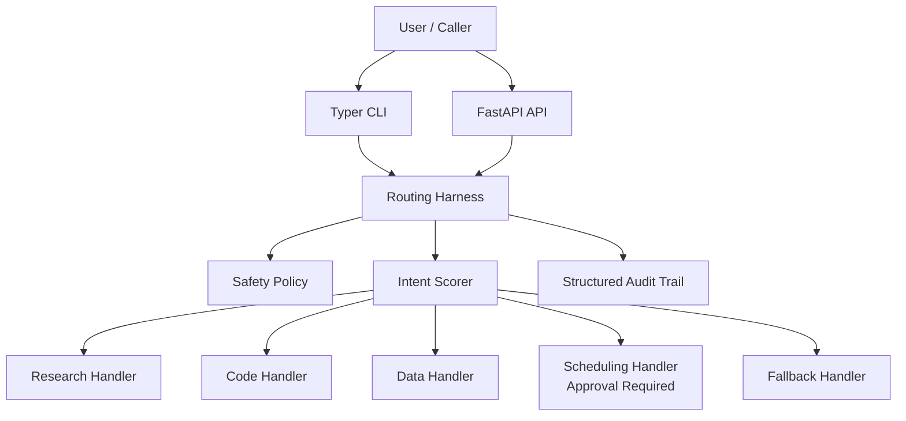

# Architecture

Confidence-scored intent router that dispatches research, code, data, and scheduling requests to explicit handlers.

```mermaid
flowchart TD
    User[User / Caller] --> CLI[Typer CLI]
    User --> API[FastAPI API]
    CLI --> Harness[Routing Harness]
    API --> Harness
    Harness --> Policy[Safety Policy]
    Harness --> Router[Intent Scorer]
    Router --> Research[Research Handler]
    Router --> Code[Code Handler]
    Router --> Data[Data Handler]
    Router --> Scheduling[Scheduling Handler<br/>Approval Required]
    Router --> Fallback[Fallback Handler]
    Harness --> Audit[Structured Audit Trail]
```
